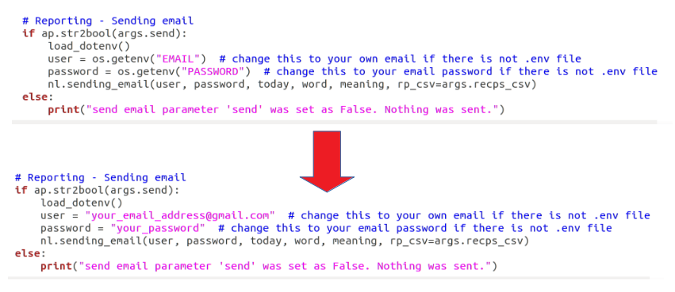

# RAE Daily Word
Scrapes RAE webpage sending by email today's featured word and its meaning. Learn a new spanish word everyday by uploading this code to your server ;)


### :boom: **Briefing and Inspiration**
Once upon a time...

### :wrench: **Configuration**
### Step 1
Install all mandatory modules -> `Pip install requirements.txt`

### Step 2
Set email sender (skip this step if you are not sending the word by email)
There are two options here. Using dotenv module or hardcoding your email info to the main.py script

Dotenv method:
Create a new file named ".env" and type in the following:
```
EMAIL=your_email_address@gmail.com
PASSWORD=your_password
```

Hard code method:
Open the main.py script with any text editor and type in your email address and password (user and password variables)



*Note:* Notice that either way, the email address must be a gmail.com account

### Step 3
Add your recipients
There is no recipients limit. You can add as many as you want. These recipients are those email addresses where the word and its meaning will be sent. To add or delete recipients create or go to the /data/recipients.csv file
This file has only one column. Each recipient should be placed in one line. 


### Step 4
Further configuration - Argparse
By default, the script will run without any additional configuration. However, there are 4 additional parameters you can play with to adjust the code to each individual's necessities. These are:


* update: if yes, today's featured word will be saved into a csv file. This file can be found here /data/words.csv
* words_csv: file path where words and meaning will be stored.
* send: if yes sends word by email
* recps_csv: file path where recipients email are read from. This file can be found here /data/recipients.csv

### Step 5
Run the script
Once you have installed all modules and set all mandatory settings you are ready to run the code.
Run it by typing on your terminal -> `Python main.py`

If all settings were set correctly, you should recieve an email shortly after hitting enter. Likewise, a new file named words.csv should have appeared at /data/words.csv

### :file_folder: **Folder structure**
```
└── project
    ├── .gitignore
    ├── .env
    ├── requeriments.txt
    ├── README.md
    ├── main.py
    ├── notebooks
    ├── packages
    │   ├── Acquisition
    │   │   ├── argparser.py
    │   │   └── scraper.py
    │   ├── Analyzing
    │   │   └── analysis.py
    │   └── Reporting
    │   │   └── newsletter.py
    └── data
        ├── recipients.csv
        └── words.csv
```

### :love_letter: **Contact info**
Any doubt? Advice? Death threat?? Don't hesitate to contact me!

