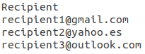

# RAE Daily Word
Scrapes RAE webpage sending by email today's featured word and its meaning. Learn a new spanish word everyday by uploading this code to your server :wink:

<p align="center">
  
</p>

## :boom: Daily newsletter
The idea behind this script was to enhance anyone's vocabulary by learning a new Spanish word every day.

## :wrench: Configuration
### Step 1

Install python 3.7 and mandatory dependencies listed in the requirements file.

```
conda create -n new_env_name_here
conda activate new_env_name_here
conda install python=3.7
pip install -r requirements.txt
```

**Note:** Environment managers differ from one another. It's strongly recommended to check its documentation.

### Step 2

You have two options here. Using the dotenv module or hardcoding your email info to the main.py script. Either way, the email address must be a gmail.com account

Dotenv method:
Create a new file named ".env" and type in the following:
```
EMAIL=your_email_address@gmail.com
PASSWORD=your_password
```

Hardcoding method:
Open the main.py script with any text editor and type in your email address and password (user and password variables)

### Step 3

There is no recipients limit. You can add as many as you want. Add or delete recipients modifying the file /data/recipients.csv
This csv file has only one column. Each recipient should be placed in one line. 

<p align="center">
  
</p>

### Step 4

The script will run without any additional configuration. However, there are 4 additional parameters you can play with to tweak the code to anyone's necessities. These are:

<p align="center">
  
</p>

* update: if yes, today's featured word will be saved into a csv file. This file can be found here /data/words.csv
* words_csv: file path where words and meaning will be stored.
* send: if yes, sends word by email
* recps_csv: file path where recipients email are read from. This file can be found here /data/recipients.csv

## :snake: Running the main.py script

Once you have gone through all configuration steps you are ready to run the script by typing `python main.py` on your terminal.

If settings were set up correctly, you should receive an email shortly after hitting enter. Likewise, a new file named words.csv should have appeared at /data/words.csv

## :file_folder: Folder structure
```
└── project
    ├── .gitignore
    ├── .env
    ├── requirements.txt
    ├── README.md
    ├── main.py
    ├── notebooks
    ├── packages
    │   ├── Acquisition
    │   │   ├── argparser.py
    │   │   └── scraper.py
    │   ├── Analyzing
    │   │   └── analysis.py
    │   └── Reporting
    │       └── newsletter.py
    └── data
        ├── recipients.csv
        └── words.csv
```

## :star: Acknowledgements
My dad, who gave the idea.

## :love_letter: Contact info
Doubts? Advice? Drop me a line! :smirk:
